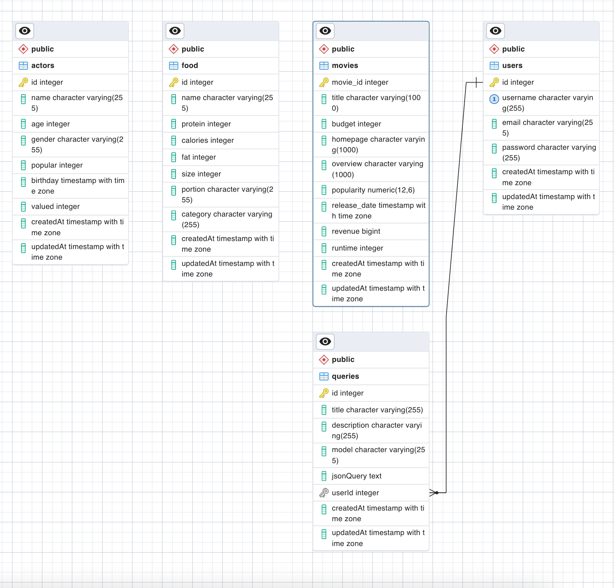

### Architecture:

The query builder application is built using a client-server architecture, where the client is built using ReactJS on the frontend and the server is built using Node.js with Express on the backend. The frontend and backend communicate with each other using RESTful API endpoints.

### Design Choices:

Backend Framework: The backend of the application is built using Node.js with Express. Express was chosen for its simplicity, flexibility, and scalability.

API Design: The RESTful API design was chosen to provide a standardized and scalable way of communicating between the frontend and the backend. Each endpoint is designed to perform a specific action, such as retrieving data or updating data.

Database: For this application, I have used a `PostgreSQL` database to store and retrieve data. PostgreSQL was chosen for this project as a good entry point and have been a good learning Project :)

Query Building: The application allows the user to build custom queries using a simple and intuitive UI. The user can add conditions and clauses to the query as needed, and the application dynamically generates the corresponding with `Sequelize`.

### Instructions:
To install and run the query builder application, follow these steps:
Clone the repository to your local machine.
Navigate to the project directory and run "npm install" to install the necessary dependencies.
Start the server by running "npm start" in the terminal.
the server will be listening on "http://localhost:8082".

### Steps I Followed
1. Set up a Node.js environment and install the necessary dependencies such as Express and any database drivers you plan to use.

2. Define the API endpoints that will allow the client-side application to interact with the server. This may include endpoints for creating, updating, and deleting data as well as endpoints for retrieving data based on certain criteria.

3. Implement the necessary logic in your API endpoints to generate dynamic queries based on the parameters passed in the request. You can use a library such as Knex.js or Sequelize to build the queries programmatically.

4. Handle any errors that may occur during the query building or execution process and return informative error messages to the client-side application.
